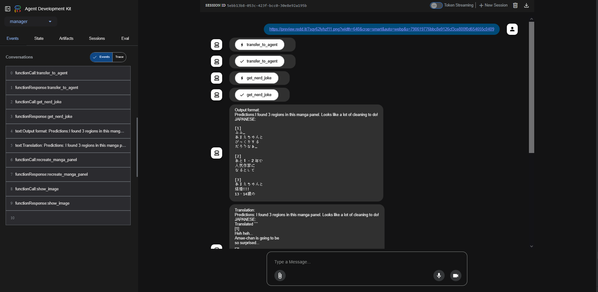
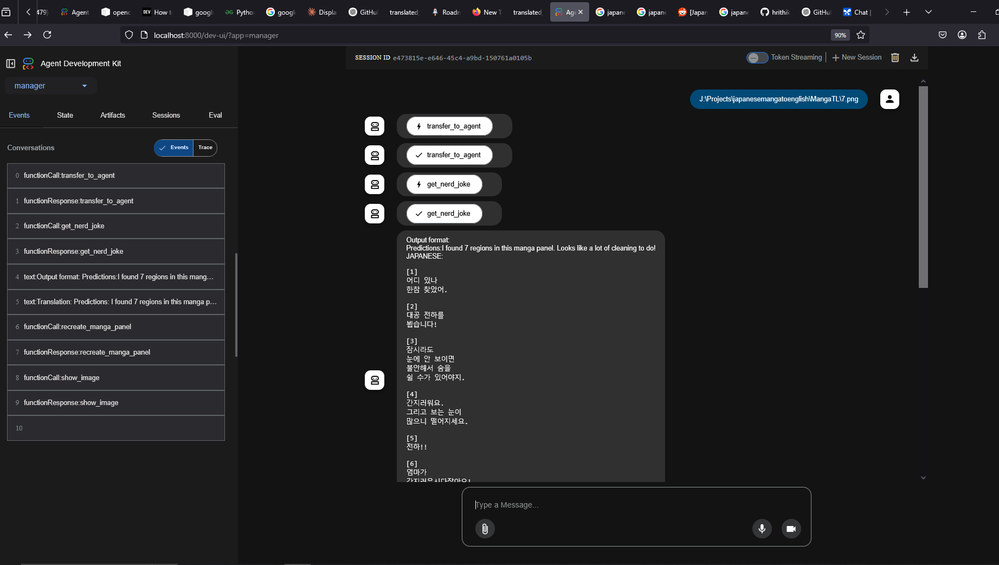

# 🈺 ADK Manga Translator

A multi-agent, multimodal pipeline built using Google's **Agent Development Kit (ADK)** to translate Japanese manga panels and Korean manwha into English. This system is modular, autonomous, and capable of handling the full pipeline from image preprocessing to final language translation and proofreading.

---

## 🧠 Project Overview

**ADK Manga Translator** is a workflow of intelligent agents designed to:
- Clean and preprocess manga panels.
- Perform high-quality Japanese-to-English translation.
- Proofread and refine the output iteratively.

This setup uses a **manager agent** to orchestrate all the sub-agents in a structured pipeline using `SequentialAgent` and `LoopAgent` abstractions.

---

## 🕹️ Agent Architecture

| **Agent**         | **Type**           | **Description**                                                             |
|------------------|--------------------|-----------------------------------------------------------------------------|
| `manager`        | `Agent`            | Root agent using `gemini-2.0-flash`; delegates tasks to sub-agents.         |
| `workflow`       | `SequentialAgent`  | Orchestrates the full pipeline: cleaning → translating → proofreading.      |
| `refinement_loop`| `LoopAgent`        | Runs `translator` in a 1-pass loop for QA (can be extended).                |
| `manga_cleaner`  | Sub-Agent          | Cleans images and removes visual artifacts.                                 |
| `translator`     | Sub-Agent          | Translates Japanese text to fluent English.                                 |
| `proof_reader`   | Sub-Agent / Tool   | Refines translated output for grammar and natural flow.                     |


---
## 📝 Examples

### Example 1

| Input (Japanese Panel)                                     | Output (Translated Panel)                                 |
|------------------------------------------------------------|-----------------------------------------------------------|
|  |         |

---

### Example 2

| Input (Japanese Panel)                                     | Output (Translated Panel)                                 |
|------------------------------------------------------------|-----------------------------------------------------------|
|  |         |


## Installation:


This guide helps you set up the **ADK Manga Translator** project locally.

---

## Prerequisites

- Python 3.10 or higher
- Git
- [Google ADK](https://developers.google.com/ai) properly configured (API keys, etc.)
- Other dependencies listed in `requirements.txt`

---

## Steps

### 1. Clone the Repository

```bash
git clone https://github.com/hrithik-naik/adk-manga-translator.git
cd adk-manga-translator
```
## 2. Create a venv 

```bash
python -m venv venv
# Windows
.\venv\Scripts\activate
# Linux/Mac
source venv/bin/activate
```
## 3. Install Dependencies:

```bash
pip install -r requirements.txt
```
## 4. Setup environment variables :
Go to the `manager` folder and inside the `.env` file. Then, paste your API key obtained from [Google AI Studio](https://aistudio.google.com/prompts/new_chat) into the `.env` file.
```bash

GOOGLE_ADK_API_KEY=your_api_key_here
GOOGLE_GENAI_USE_VERTEXAI=FALSE
```
## 5. Running the project:
Run the command inside ur terminal
```bash
adk web 
```
and in the top left drop down choose manager as your agent.
## 6. Query Format:
You can give any online links or even offline links.  
**Example:**  
https://preview.redd.it/7sqv62lyhzf11.png?width=640&crop=smart&auto=webp&s=790619776bbc8e9126cf3ce800f0d654655c0409

### Example 

|    Online Link                                 | Offline Link                                 |
|------------------------------------------------------------|-----------------------------------------------------------|
|     |         |

## ⚠️ Disclaimer

This project was created mainly for fun and experimentation. While it leverages Google Gemini and custom tools—such as a CNN-based segmentation model trained using YOLOv11 for manga cleaning and preprocessing—the translations and outputs may occasionally contain errors or inaccuracies.

The system uses **4 custom tools** to handle various stages of the manga translation pipeline. If you encounter buggy or unexpected output, try rerunning the query or adjusting the prompt for better results.

Feel free to use this project, experiment with it, and contribute improvements!


Thank you for trying out the ADK Manga Translator!  
Happy translating! 🎉