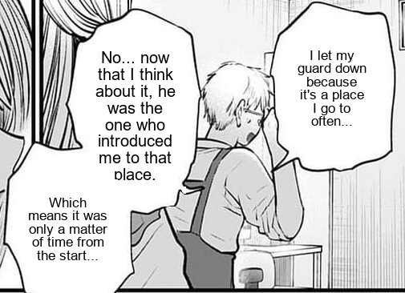

# 🈺 ADK Manga Translator

A multi-agent, multimodal pipeline built using Google's **Agent Development Kit (ADK)** to translate Japanese manga panels into English. This system is modular, autonomous, and capable of handling the full pipeline from image preprocessing to final language translation and proofreading.

---

## 🧠 Project Overview

**ADK Manga Translator** is a workflow of intelligent agents designed to:
- Clean and preprocess manga panels.
- Perform high-quality Japanese-to-English translation.
- Proofread and refine the output iteratively.

This setup uses a **manager agent** to orchestrate all the sub-agents in a structured pipeline using `SequentialAgent` and `LoopAgent` abstractions.

---

## 🕹️ Agent Architecture

| **Agent**         | **Type**           | **Description**                                                             |
|------------------|--------------------|-----------------------------------------------------------------------------|
| `manager`        | `Agent`            | Root agent using `gemini-2.0-flash`; delegates tasks to sub-agents.         |
| `workflow`       | `SequentialAgent`  | Orchestrates the full pipeline: cleaning → translating → proofreading.      |
| `refinement_loop`| `LoopAgent`        | Runs `translator` in a 1-pass loop for QA (can be extended).                |
| `manga_cleaner`  | Sub-Agent          | Cleans images and removes visual artifacts.                                 |
| `translator`     | Sub-Agent          | Translates Japanese text to fluent English.                                 |
| `proof_reader`   | Sub-Agent / Tool   | Refines translated output for grammar and natural flow.                     |

---
## 📝 Examples

### Example 1

| Input (Japanese Panel)                                     | Output (Translated Panel)                                 |
|------------------------------------------------------------|-----------------------------------------------------------|
|  |         |

---

### Example 2

| Input (Japanese Panel)                                     | Output (Translated Panel)                                 |
|------------------------------------------------------------|-----------------------------------------------------------|
|  |         |

## 🚀 How It Works

### 🔗 Input Format
